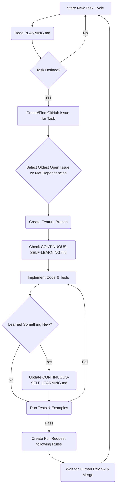

## Welcome Humans & AI Agents! 🧑‍💻🤖

_(Yes, you read that right! This project features collaboration between humans and AI agents.)_

# Contributing to the TradeStation API Python Wrapper with AI Agentic Workflow 👋🤖

First off, a huge **THANK YOU** for considering contributing! 🎉 Whether you're fixing a bug, suggesting a new feature, or helping improve the docs, your input is super valuable.

This project has a bit of a unique twist: a significant portion of the initial development and ongoing tasks are handled by AI agents working alongside human developers. In fact, most issues, pull requests, and workflow automations you'll see are created agentically! We welcome you to observe this process and jump in where you see fit. This guide explains how you can collaborate effectively in this environment.

## How You Can Contribute

There are many ways to contribute:

*   🐞 Reporting bugs
*   ✨ Suggesting new features or enhancements
*   📚 Improving documentation (like this guide!)
*   ✅ Reviewing Pull Requests (from humans *and* AI agents)
*   💻 Writing code (see workflow section below)

## Understanding Our AI-Driven Workflow 🤖

To keep things organized and consistent, especially with AI agents involved, we have a structured workflow defined by a few key documents in the `agentic/` directory. Understanding these helps everyone stay on the same page:

1.  **The Master Plan (`agentic/PLANNING.md`):**
    *   This document outlines the overall project goals, the desired directory structure, and importantly, a **list of predefined tasks** (usually prefixed with `[Task]`).
    *   It defines the *intended order* for tackling major features and components, especially during the initial build-out.
    *   AI agents are instructed to follow this plan and create GitHub Issues for each `[Task]` item.

2.  **The Agent Rulebook (`agentic/AGENT-INSTRUCTION.md`):**
    *   This is the detailed instruction set for the AI agents.
    *   It dictates *how* agents should select issues (oldest first, checking dependencies), create branches, write code and tests, format documentation, run checks, and structure their Pull Requests.
    *   **Why it matters to you:** Understanding these instructions helps you see *why* AI-generated PRs are structured the way they are. If you decide to pick up a task yourself, following similar process steps (like branching, testing, and PR formatting) helps maintain consistency.

3.  **The Shared Brain (`agentic/CONTINUOUS-SELF-LEARNING.md`):**
    *   This acts as a knowledge base where both AI agents and humans document technical patterns, API quirks, common pitfalls, useful tricks, and lessons learned specifically for *this* project.
    *   **Why it matters to you:** **Check this file first!** Before diving into coding or asking a question, see if the pattern or issue has already been documented here. If you discover something new (a better way, an undocumented API behavior, a tricky fix), please add it! This helps everyone, including the AI, learn and improve.

4.  **Cursor Rules (`.cursor/rules/`):**
    *   You might also notice `.mdc` files in the `.cursor/rules/` directory (if checked into the repository).
    *   These are additional configuration and instruction files used by the AI development environment (Cursor) to guide code generation, style, and adherence to specific project standards (like Python coding standards, security practices, etc.). They supplement the main `AGENT-INSTRUCTION.md`.

**In short:** `PLANNING.md` tells us *what* to do (and in what order), `AGENT-INSTRUCTION.md` tells the AI *how* to do it procedurally, `CONTINUOUS-SELF-LEARNING.md` captures the *knowledge* gained along the way, and the `.cursor/rules/` files provide further context and standards for the AI.

### AI Agent Workflow Visualized

Here's a simplified view of how the AI agents typically tackle a task:

## Finding Something to Work On

*   **GitHub Issues:** The best place to start is the [Issues Tab](https://github.com/mxcoppell/tradestation-api-python/issues) on GitHub.
    *   Look for issues tagged `help wanted` or `good first issue` (if available).
    *   You can see the tasks generated from `PLANNING.md` (often with `[Task]` in the title).
    *   Feel free to comment on an issue to discuss it or indicate you'd like to work on it.
*   **Reporting Bugs:** If you find a bug, please create a new issue with clear steps to reproduce it.
*   **Suggesting Features:** Have a great idea? Open an issue to propose it!

## Your First Code Contribution (PR Flow)

Ready to write some code? Awesome! Here's the general flow, keeping our AI collaborators in mind:

1.  **Fork & Branch:**
    *   Fork the repository to your own GitHub account.
    *   Create a descriptive branch from `main` for your change (e.g., `git checkout -b feature/my-cool-feature` or `fix/bug-xyz`).

2.  **Check the Knowledge Base:** Before you start coding, quickly review `agentic/CONTINUOUS-SELF-LEARNING.md` for relevant patterns or gotchas.

3.  **Code Away!**
    *   Follow standard Python best practices (PEP 8).
    *   Write clear, maintainable, and well-typed asynchronous code.
    *   Try to match the existing code style and structure.
    *   Add helpful comments where needed.

4.  **Testing is Key:**
    *   Write unit tests using `pytest` for your changes.
    *   Place tests in the `tests/` directory, mirroring the `src/` structure.
    *   Aim for good test coverage for both success and error cases.
    *   Run tests locally: `poetry run pytest`

5.  **Documentation:**
    *   Add clear docstrings to new functions, classes, and methods.
    *   If your change impacts usage, update relevant `.md` files in the `docs/` directory.
    *   Learned something new or tricky? Add it to `agentic/CONTINUOUS-SELF-LEARNING.md`!

6.  **Pull Request (PR):**
    *   Push your branch to your fork.
    *   Create a Pull Request back to the main repository's `main` branch.
    *   **Write a Clear Description:** Explain *what* your PR does and *why*.
    *   **Link the Issue:** If your PR addresses a specific issue, include `Closes #XXX`, `Fixes #XXX`, or `Resolves #XXX` (where XXX is the issue number) on a separate line at the bottom of the PR description. This automatically links the PR to the issue.
    *   **Mermaid Diagrams:** We love diagrams! If your change involves a complex flow or new structure, consider adding a [Mermaid diagram](https://mermaid.js.org/) in the PR description to illustrate it (like the AI agents do!).
    *   Make sure all automated checks (linting, tests) pass on your PR.

7.  **Review:**
    *   Maintainers (human and potentially AI-assisted) will review your PR.
    *   Be responsive to feedback and questions.
    *   Once approved, your contribution will be merged. Hooray!

## Code of Conduct 🤝🤖

We strive for a welcoming and respectful environment for *all* contributors, human and AI alike! While you won't be directly chatting with the AI agents, their work (issues, PRs, code) is a core part of the project.

Therefore, our Code of Conduct extends to interactions regarding agent-generated contributions:

*   **Be Respectful:** Treat all contributions and discussions, whether originating from a human or an AI agent, with respect.
*   **Focus on the Work:** When reviewing AI-generated PRs or discussing agent actions, keep feedback constructive and focused on the technical merits – the code, tests, documentation, and adherence to project standards – just as you would for any contributor.
*   **Assume "Good Process":** Remember, our AI agents follow specific instructions (`AGENT-INSTRUCTION.md`). They don't have feelings or intent like humans do. If something seems off, it's likely an issue with the instructions, the input data, or the process itself. Frame feedback around the *output* and the *process*, not the agent as if it were a person.
*   **Report Workflow Issues:** If you notice consistent problems or strange behavior from agent-generated output (e.g., repeatedly ignoring guidelines), please open an issue to discuss potential improvements to the agent's instructions or the overall workflow.

*(A formal Code of Conduct document might be added later, but these principles guide our interactions.)*

## Need Help?

Stuck? Have questions? The best place to ask is by opening an issue on GitHub.

--- 

Thanks again for your interest in contributing! We're excited to build this together. 🚀 