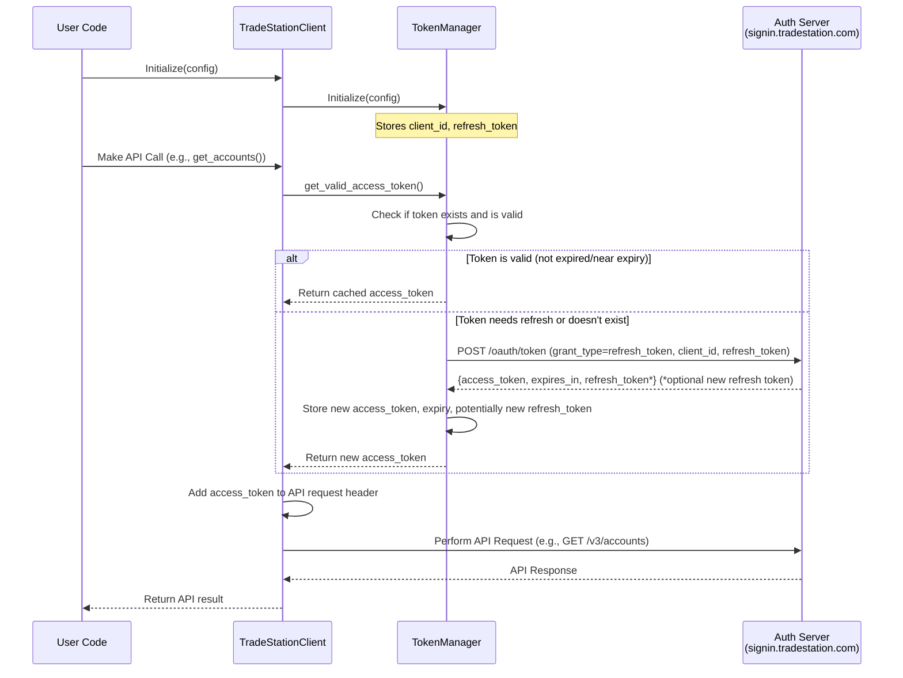

# Authentication

The TradeStation API Python Wrapper uses OAuth 2.0 for authentication. This document explains how to authenticate with the TradeStation API using this library.

## TradeStation API Credentials

To use this library, you need to obtain TradeStation API credentials:

1. Log in to your TradeStation account
2. Navigate to the [Developer Portal](https://developer.tradestation.com/)
3. Create a new application to get your Client ID (`client_id`) and optionally Client Secret (`client_secret`)
4. Note your application's redirect URI
5. Complete the OAuth flow to obtain your initial Refresh Token (`refresh_token`)

## OAuth Client Types

TradeStation supports two types of OAuth clients:

### Public Clients (Default)
- **No client secret required** - These clients do not need a `client_secret` for authentication
- Suitable for applications where the code is publicly accessible (mobile apps, single-page apps, desktop apps)
- The library works with public clients by default - just provide `client_id` and `refresh_token`

### Confidential Clients
- **Requires client secret** - These clients must provide a `client_secret` for authentication
- Suitable for server-side applications where credentials can be securely stored
- The `client_secret` must be kept secure and never exposed in client-side code
- If your TradeStation application is configured as a confidential client, you **must** provide the `client_secret`

**Note:** If you're unsure which type you have, check your application settings in the TradeStation Developer Portal. If no `client_secret` was provided when you created your application, you have a public client.

## Authentication Methods

The library supports several methods for providing authentication credentials. The client prioritizes credentials passed directly, then looks at environment variables.

### 1. Environment Variables

You can set credentials as environment variables:

```bash
# Required
CLIENT_ID=your_client_id
REFRESH_TOKEN=your_refresh_token # Note: Only CLIENT_ID is automatically read from env during initialization.
ENVIRONMENT=Live  # or Simulation (Used for API endpoints, not the auth endpoint)

# Optional - only for confidential clients
CLIENT_SECRET=your_client_secret  # Only required if using a confidential OAuth client
```

You can use a `.env` file for this purpose. The library includes a `.env.sample` file you can copy and modify.

### 2. Configuration Dictionary

You can pass configuration directly when creating the client:

**For Public Clients (no secret needed):**
```python
from src.client.tradestation_client import TradeStationClient

client = TradeStationClient({
    "client_id": "your_client_id",
    "refresh_token": "your_refresh_token",
    "environment": "Live"  # or "Simulation"
})
```

**For Confidential Clients (with secret):**
```python
from src.client.tradestation_client import TradeStationClient

client = TradeStationClient({
    "client_id": "your_client_id",
    "client_secret": "your_client_secret",  # Required for confidential clients
    "refresh_token": "your_refresh_token",
    "environment": "Live"  # or "Simulation"
})
```

This is the recommended way to provide the `refresh_token` and `client_secret`.

### 3. Direct Parameters

You can provide some parameters directly to the constructor:

**For Public Clients:**
```python
from src.client.tradestation_client import TradeStationClient

client = TradeStationClient(
    refresh_token="your_refresh_token",
    environment="Live"
)
```

**For Confidential Clients:**
```python
from src.client.tradestation_client import TradeStationClient

# Option A: client_secret via config dict
client = TradeStationClient(
    config={"client_secret": "your_client_secret"},
    refresh_token="your_refresh_token",
    environment="Live"
)

# Option B: Set CLIENT_SECRET environment variable, then:
client = TradeStationClient(
    refresh_token="your_refresh_token",
    environment="Live"
)
```

When using this method, the client will look for `CLIENT_ID` and `CLIENT_SECRET` in the environment variables if not provided directly or in a config dictionary. The `refresh_token` *must* be provided either directly or via the config dictionary.

## Obtaining a Refresh Token

To obtain your initial refresh token:

1. Register your application in the TradeStation Developer Portal
2. Set up your redirect URI (e.g., `http://localhost:8000/callback`)
3. Construct the authorization URL:

```
https://api.tradestation.com/v2/authorize?
  response_type=code&
  client_id=YOUR_CLIENT_ID&
  redirect_uri=YOUR_REDIRECT_URI&
  audience=https://api.tradestation.com&
  scope=openid offline_access profile MarketData ReadAccount Trade Matrix OptionSpreads&
  state=YOUR_STATE_VALUE
```

4. Navigate to this URL in a browser
5. Authorize your application
6. You'll be redirected to your redirect URI with a `code` parameter
7. Exchange this code for tokens using a tool like `curl`:

**For Public Clients (no secret):**
```bash
curl -X POST https://signin.tradestation.com/oauth/token \
  -H "Content-Type: application/x-www-form-urlencoded" \
  -d "grant_type=authorization_code" \
  -d "client_id=YOUR_CLIENT_ID" \
  -d "code=YOUR_CODE" \
  -d "redirect_uri=YOUR_REDIRECT_URI"
```

**For Confidential Clients (with secret):**
```bash
curl -X POST https://signin.tradestation.com/oauth/token \
  -H "Content-Type: application/x-www-form-urlencoded" \
  -d "grant_type=authorization_code" \
  -d "client_id=YOUR_CLIENT_ID" \
  -d "client_secret=YOUR_CLIENT_SECRET" \
  -d "code=YOUR_CODE" \
  -d "redirect_uri=YOUR_REDIRECT_URI"
```

(Note: The token exchange endpoint is `https://signin.tradestation.com/oauth/token`)

8. From the response, save both the `refresh_token` and (if applicable) `client_secret` values securely.

## Token Refreshing

The library automatically handles token refreshing. When an access token expires, or is within 5 minutes of expiring, the library will use the stored refresh token to obtain a new access token by making a request to `https://signin.tradestation.com/oauth/token`.

Importantly, the refresh process itself might return a *new* refresh token. The library will automatically store this new refresh token and use it for future refreshes.

You don't need to manage this process manually, but ensure the initial `refresh_token` is provided correctly. If the refresh process fails (e.g., due to an invalid refresh token or network issue), the library may raise a `ValueError`.

### Authentication Flow Diagram



## Getting the Current Refresh Token

You may need to retrieve the current refresh token (e.g., to save it for future sessions after it might have been updated):

```python
refresh_token = client.get_refresh_token()
if refresh_token:
    print(f"Current refresh token: {refresh_token}")
else:
    print("No refresh token available.")
```

## Environments

TradeStation provides two environments:

- **Live**: Uses the production API at `https://api.tradestation.com`
- **Simulation**: Uses the simulator API at `https://sim.api.tradestation.com`

Specify the environment (`"Live"` or `"Simulation"`) when creating the client. This setting determines the base URL for API calls but does *not* affect the authentication endpoint, which is always `https://signin.tradestation.com/oauth/token`.

## Debug Mode

You can enable debug mode for more detailed logging, potentially including information about the authentication process:

```python
client = TradeStationClient(debug=True)
```

(Note: The specifics of debug logging might vary depending on the client implementation details.)

## Security Considerations

- Always keep your `client_id`, `client_secret` (if applicable), and `refresh_token` secure.
- **Never expose your `client_secret`** in client-side code, public repositories, or logs.
- Do not commit these values directly into version control.
- Use environment variables, a secure configuration manager (like HashiCorp Vault, AWS Secrets Manager), or direct secure injection in production.
- For confidential clients, ensure the `client_secret` is stored with the same level of security as passwords or API keys.
- Consider rotating your refresh token periodically if your security policy requires it (though the library handles automatic updates if the API provides new ones).
- If you suspect your `client_secret` has been compromised, regenerate it immediately in the TradeStation Developer Portal.