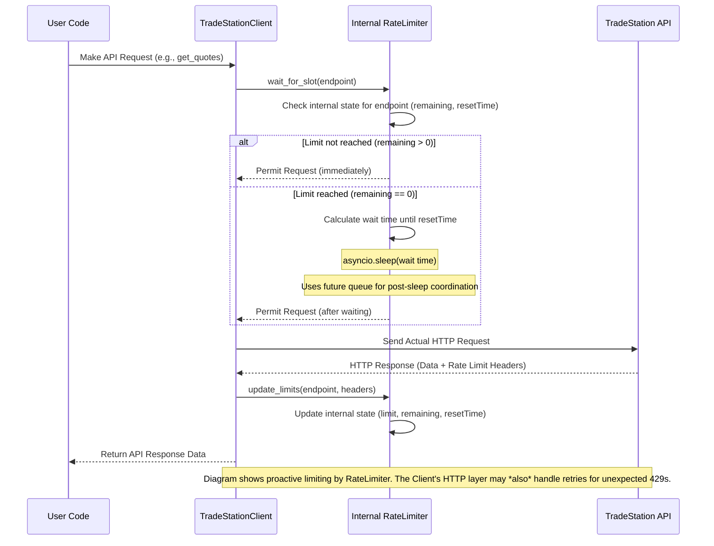

# Rate Limiting

The TradeStation API enforces rate limits to ensure fair usage and system stability. The TradeStation API Python Wrapper includes a proactive `RateLimiter` utility to help manage these limits gracefully.

## How API Rate Limits Work

TradeStation's API typically uses the following rate limiting approach:

1.  Each endpoint or group of endpoints has a specific rate limit (often around 120 requests per minute, but this can vary).
2.  When you make a request, the API usually returns rate limit information in the response headers.
3.  If you exceed the rate limit, the API returns a `429 (Too Many Requests)` error.

The relevant headers often include:

-   `X-RateLimit-Limit`: The maximum number of requests allowed in the current time window.
-   `X-RateLimit-Remaining`: The number of requests remaining in the current time window.
-   `X-RateLimit-Reset`: The timestamp (often in seconds) when the rate limit window resets.

## Proactive Rate Limiting by the Client

The client utilizes an internal `RateLimiter` class that attempts to *prevent* hitting the API's rate limit in the first place:

1.  **Tracking**: It stores the latest known rate limit status (`limit`, `remaining`, `resetTime` in milliseconds) for each endpoint based on the headers received from previous API responses (`update_limits` method).
2.  **Checking**: Before making an API request, the client calls the `RateLimiter.wait_for_slot(endpoint)` method.
3.  **Waiting (if necessary)**: If the `RateLimiter` determines that `remaining` is 0 for that endpoint based on its tracked state, `wait_for_slot` will:
    *   Calculate the time needed to wait until the stored `resetTime`.
    *   Pause execution asynchronously using `asyncio.sleep()` for that duration.
    *   Use an internal `asyncio.Future` queue to manage multiple requests that might become ready simultaneously after sleeping, ensuring they proceed one by one for that endpoint.
4.  **Proceeding**: Once `wait_for_slot` completes (either immediately because `remaining > 0`, or after sleeping), the client proceeds to make the actual HTTP request.
5.  **Updating**: After receiving the API response, the client updates the `RateLimiter`'s state for that endpoint using the new rate limit headers.

This proactive waiting happens automatically within the client's request cycle.

### Rate Limiting Flow Diagram



## Example

Because the client handles proactive rate limiting internally, your code often doesn't need explicit delays:

```python
import asyncio
from src.client.tradestation_client import TradeStationClient

async def main():
    # Assumes client is configured with credentials
    client = TradeStationClient()

    try:
        # The client's internal RateLimiter will pause if necessary
        for symbol in ["AAPL", "MSFT", "GOOGL", "AMZN", "FB", "TSLA"]:
            # Assuming get_quotes takes a single symbol for this example
            quote_response = await client.market_data.get_quotes([symbol]) # Example method
            if quote_response and quote_response.Quotes:
                 print(f"{symbol}: ${quote_response.Quotes[0].Last}")
            else:
                print(f"Could not get quote for {symbol}")
            # No explicit asyncio.sleep needed here for rate limiting
    finally:
        await client.close()

asyncio.run(main())
```

## Rate Limit Configuration and Monitoring

The `RateLimiter` uses a default limit (e.g., 120/min) initially but updates its internal state based on the actual `X-RateLimit-*` headers received from the API.

You might be able to inspect the current tracked rate limit status if the main client exposes its internal `RateLimiter` instance (this depends on the `TradeStationClient` implementation):

```python
# Hypothetical example assuming client exposes RateLimiter
# http_client = client.get_http_client() # Or similar method
# rate_limiter = http_client.get_rate_limiter() # Or similar method

# Check rate limit for a specific endpoint path
# endpoint_path = "/v3/marketdata/quotes"
# limit_info = rate_limiter.get_rate_limit(endpoint_path)
# if limit_info:
#     print(f"Endpoint: {endpoint_path}")
#     print(f"  Limit: {limit_info['limit']}")
#     print(f"  Remaining: {limit_info['remaining']}")
#     # Note: resetTime is stored internally in milliseconds
#     print(f"  Reset Timestamp (ms): {limit_info['resetTime']}")
```

## Rate Limiting Strategy Implemented

The internal `RateLimiter` employs the following strategy:

1.  **Endpoint-Specific Tracking**: Tracks `limit`, `remaining`, and `resetTime` individually for each API endpoint path string based on received headers.
2.  **Proactive Waiting**: If `remaining` count for an endpoint is zero, it asynchronously waits (`asyncio.sleep`) until the calculated `resetTime`.
3.  **Post-Wait Coordination**: Uses an `asyncio.Future` queue per endpoint to ensure that multiple requests waiting for the same reset don't all proceed at once, potentially causing issues. They are allowed to proceed sequentially after the wait.
4.  **State Update**: Relies on the calling code (the HTTP client layer) to call `update_limits` with the headers from each successful response to keep its internal state accurate.

## Handling Rate Limit Exceptions (429 Errors)

The primary goal of the `RateLimiter` is to *prevent* `429 (Too Many Requests)` errors by waiting proactively. However, 429 errors might still occur due to:

-   Multiple instances of the client running without shared state.
-   Sudden changes in API limits not yet reflected in the client's tracked state.
-   Other network or timing issues.

The `RateLimiter` class itself **does not handle 429 responses or perform retries**. This responsibility typically lies within the higher-level HTTP client wrapper that uses the `RateLimiter`. That wrapper might catch a 429 error, potentially wait based on a `Retry-After` header (if provided by the API) or use exponential backoff, and then retry the request automatically.

If the HTTP client's retry attempts fail, or if you want to implement custom logic, you might still need to catch exceptions related to rate limiting in your application code:

```python
try:
    # Make API request
    response = await client.market_data.get_quotes(["AAPL"])
except Exception as e:
    # Check if the exception indicates a 429 error after retries failed
    if "429" in str(e) or "Rate limit exceeded" in str(e): # Example checks
        print("Rate limit issue persisted after client retries. Consider reducing request frequency.")
    else:
        print(f"An unexpected error occurred: {e}")
```

## Performance Considerations

To work effectively with API rate limits:

1.  **Batch requests**: Use API methods that allow fetching data for multiple items (e.g., multiple symbols in `get_quotes`) in a single call whenever possible.
2.  **Cache responses**: Avoid re-requesting data that doesn't change frequently.
3.  **Be mindful of overall request volume**: Even with proactive limiting, high burst rates can lead to longer wait times within your application.
4.  **Monitor usage patterns**: Understand which parts of your application make the most requests.

## Advanced Rate Limiting

If the default `RateLimiter` behavior isn't suitable, you could potentially provide a custom `RateLimiter` implementation to the client, provided the client's design allows for dependency injection. This would involve creating a subclass or a compatible class implementing the required methods like `wait_for_slot` and `update_limits`.

```python
# from src.utils.rate_limiter import RateLimiter, RateLimit # Assuming types are needed

# class CustomRateLimiter(RateLimiter):
#     async def wait_for_slot(self, endpoint: str) -> None:
#         # Your custom logic here
#         print(f"Custom waiting logic for {endpoint}")
#         await super().wait_for_slot(endpoint) # Or replace entirely

#     def update_limits(self, endpoint: str, headers: Dict[str, Union[str, int]]) -> None:
#         # Your custom logic here
#         print(f"Custom update logic for {endpoint}")
#         super().update_limits(endpoint, headers)

# # Hypothetical client initialization with custom limiter
# custom_limiter = CustomRateLimiter()
# http_client = create_http_client(rate_limiter=custom_limiter)
# client = TradeStationClient(http_client=http_client)
```

## Best Practices

1.  **Leverage Batching**: Prioritize API calls that retrieve data for multiple items at once.
2.  **Implement Caching**: Store results of requests for static or slowly changing data.
3.  **Understand Client Behavior**: Know that the client waits proactively; factor potential delays into your application flow.
4.  **Handle Errors**: Be prepared for occasional errors (including potential 429s if proactive limiting fails or retries are exhausted) and implement graceful handling.
5.  **Optimize Request Frequency**: Design your application to make only necessary requests. 