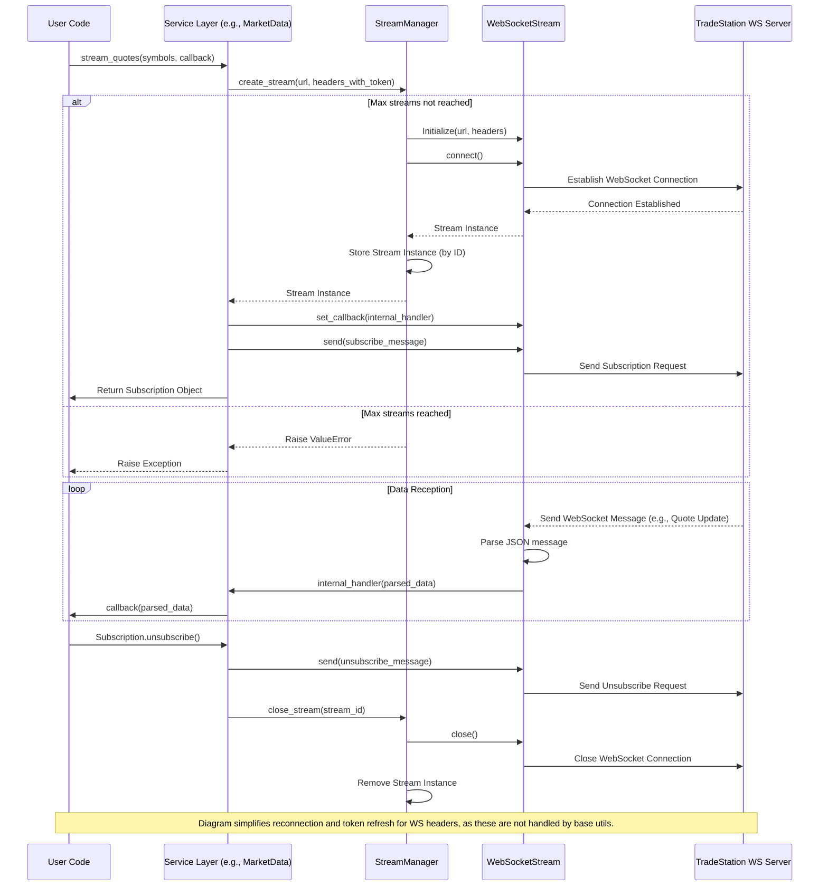

# Streaming

The TradeStation API Python Wrapper provides support for real-time data streaming via WebSockets. This document explains how to use the streaming functionality, primarily managed by the `StreamManager` and `WebSocketStream` utility classes, and exposed through higher-level service methods.

## Overview

The core streaming utilities are:

-   **`WebSocketStream`**: Manages a *single* WebSocket connection using `aiohttp`. It handles:
    *   Connection establishment (`connect`).
    *   Sending JSON messages (`send`).
    *   Receiving messages and parsing them as JSON.
    *   Passing parsed messages to an asynchronous callback function (`set_callback`).
    *   Basic connection closing (`close`).
    *   **Note:** `WebSocketStream` does *not* implement automatic reconnection, token refreshing for the WebSocket headers, or sophisticated error handling beyond basic logging/closure.

-   **`StreamManager`**: Orchestrates *multiple* `WebSocketStream` instances. It handles:
    *   Creating new streams (`create_stream`), respecting a configurable `max_concurrent_streams` limit (default 10).
    *   Tracking active streams.
    *   Closing individual streams (`close_stream`) or all streams (`close_all_streams`, `close`).
    *   **Note:** `StreamManager` itself does *not* add reconnection or token refresh logic; it relies on the provided headers during stream creation.

-   **Service Methods (e.g., `client.market_data.stream_quotes`)**: These higher-level methods utilize `StreamManager` and `WebSocketStream`. They are responsible for:
    *   Constructing the correct WebSocket URL and authentication headers (using the main client's `TokenManager`).
    *   Creating the stream via `StreamManager`.
    *   Sending subscription messages using `WebSocketStream.send`.
    *   Providing a `Subscription` object abstraction to the user for managing the specific stream request.
    *   **Crucially:** Any automatic reconnection, token refresh *for the stream headers*, or advanced error handling (like the `error_callback` mentioned in examples) must be implemented within these service methods or potentially within the user's callback, as they are **not** built into the core `WebSocketStream` or `StreamManager` utilities.

## Available Streams

The following data streams are typically available via service methods:

| Stream Type    | Description            | Service       |
| -------------- | ---------------------- | ------------- |
| Quote          | Real-time quote updates | Market Data   |
| Bar            | Price bar updates      | Market Data   |
| Trade          | Time and sales data    | Market Data   |
| OrderStatus    | Order status updates   | Order Execution |
| PositionChange | Position updates       | Brokerage     |
| BalanceChange  | Account balance updates | Brokerage     |

## Basic Usage

The streaming functionality is accessed through the service classes attached to the main `TradeStationClient`. Here's a simple example of streaming quotes:

```python
import asyncio
from dotenv import load_dotenv
from src.client.tradestation_client import TradeStationClient

async def quote_callback(quote_data):
    """Process incoming quote data"""
    # Note: This callback must be async
    print(f"Quote update: {quote_data.get('Symbol')} - Last: {quote_data.get('Last')}")

async def main():
    # Load environment variables for authentication
    load_dotenv()

    # Create client (handles authentication)
    client = TradeStationClient()

    subscription = None
    try:
        # Subscribe to quote updates using the Market Data service
        # This returns a Subscription object specific to this request
        subscription = await client.market_data.stream_quotes(
            symbols=["AAPL", "MSFT", "GOOGL"],
            callback=quote_callback
        )

        # Keep the stream running - the callback handles incoming data
        print("Streaming started. Press Ctrl+C to stop...")
        # Wait indefinitely or for a specific duration/event
        await asyncio.Event().wait()

    except KeyboardInterrupt:
        print("Stopping stream...")
    except Exception as e:
        print(f"An error occurred: {e}")
    finally:
        # Unsubscribe when done (important to release resources)
        if subscription:
            await subscription.unsubscribe()

        # Close the client (closes StreamManager and underlying connections)
        await client.close()

if __name__ == "__main__":
    asyncio.run(main())
```

**Important**: The robustness of this example (handling disconnects, token expiry during the stream) depends on the implementation within the `client.market_data.stream_quotes` method and potentially requires user logic in the callback.

## Stream Subscriptions

When you subscribe via a service method (like `stream_quotes`), it typically returns a `Subscription` object. This object is an abstraction provided by the service layer, allowing you to:

-   Unsubscribe from the specific stream request (`unsubscribe()`).
-   Potentially add more callbacks (if supported by the service layer).
-   Check the subscription status (if supported).
-   Access a unique identifier for the subscription (if needed).

```python
# Create a subscription via a service method
subscription = await client.market_data.stream_quotes(["AAPL"], quote_callback)

# Check if subscription is active (example, actual method might differ)
# if subscription.is_active():
#     print("Subscription is active")

# Unsubscribe when done
await subscription.unsubscribe()
```

## Available Streaming Methods (Examples)

These examples show how to initiate streams via the service classes. The actual parameters and returned `Subscription` object behavior might vary.

### Market Data Streaming

```python
# Quote streaming
quote_sub = await client.market_data.stream_quotes(
    symbols=["AAPL", "MSFT"],
    callback=quote_callback
)

# Bar streaming
bar_sub = await client.market_data.stream_bars(
    symbol="SPY",
    interval="1",  # e.g., 1-minute bars
    callback=bar_callback
)

# Time and sales streaming
trade_sub = await client.market_data.stream_time_and_sales(
    symbol="AAPL",
    callback=trade_callback
)

# Unsubscribe when done
await quote_sub.unsubscribe()
await bar_sub.unsubscribe()
await trade_sub.unsubscribe()
```

### Order Execution Streaming

```python
# Order status updates
order_sub = await client.order_execution.stream_order_updates(
    callback=order_update_callback
)
# ...
await order_sub.unsubscribe()
```

### Brokerage Streaming

```python
# Position updates
position_sub = await client.brokerage.stream_position_changes(
    callback=position_callback
)
# Balance updates
balance_sub = await client.brokerage.stream_balance_changes(
    callback=balance_callback
)
# ...
await position_sub.unsubscribe()
await balance_sub.unsubscribe()
```

## Error Handling and Reliability

As noted, the core `WebSocketStream` and `StreamManager` utilities **do not** provide built-in automatic reconnection or token refresh for the WebSocket headers.

-   **Disconnection**: If the WebSocket disconnects, the `_listen_for_messages` task in `WebSocketStream` will likely exit, and no further messages will be received unless reconnection logic is implemented elsewhere.
-   **Token Expiry**: If the access token used in the initial connection headers expires, the server might close the connection or reject subscription messages. The stream needs to be potentially recreated with fresh headers.
-   **Error Callbacks**: The `error_callback` parameter shown in the original documentation example is **not** a feature of the base `WebSocketStream`. If available, it's implemented by the higher-level service method you call (e.g., `stream_quotes`). Check the specific service method documentation or implementation for error handling details.

Users should be prepared to handle potential disconnections or implement their own monitoring and reconnection logic if the service layer does not provide it, or if higher reliability is needed.

## Advanced Usage

### Managing Multiple Streams

You can initiate multiple stream subscriptions simultaneously using the service methods. Keep track of the returned `Subscription` objects to unsubscribe correctly.

```python
# Subscribe to multiple streams
quote_sub = await client.market_data.stream_quotes(...)
bar_sub = await client.market_data.stream_bars(...)

# Unsubscribe individually when done
await quote_sub.unsubscribe()
await bar_sub.unsubscribe()

# Or close all streams managed by the client's StreamManager
# Note: This forcefully closes all connections without graceful unsubscribes
# await client.close_all_streams() # Use with caution
```

### Custom Stream Processing

Your asynchronous callback function is where you implement your custom logic for handling incoming data.

```python
asyn def custom_processor(data):
    # Ensure callback is async
    processed_data = process_data(data) # Your processing logic
    update_app_state(processed_data)
    await save_to_db(processed_data) # Example async operation

subscription = await client.market_data.stream_quotes(
    symbols=["AAPL"],
    callback=custom_processor
)
```

## Performance Considerations

-   The `StreamManager` limits the number of concurrent WebSocket connections (`max_concurrent_streams`).
-   Your callback function (`async def callback(data): ...`) should be efficient and non-blocking. Since it's `async`, you can use `await` for I/O operations, but avoid long-running synchronous computations that would block the event loop and delay processing of subsequent messages.
-   For CPU-intensive processing, consider using `asyncio.to_thread` or offloading work to a separate process.

## Cleanup

Always clean up resources when you are finished streaming:

1.  **Unsubscribe**: Call `await subscription.unsubscribe()` for each active subscription. This typically sends an unsubscribe message to the server.
2.  **Close Client**: Call `await client.close()`. This closes the client's `StreamManager`, which in turn closes all underlying `WebSocketStream` connections and `aiohttp` sessions.

```python
# Example cleanup
if subscription:
    await subscription.unsubscribe()

await client.close()
```

### Streaming Flow Diagram

